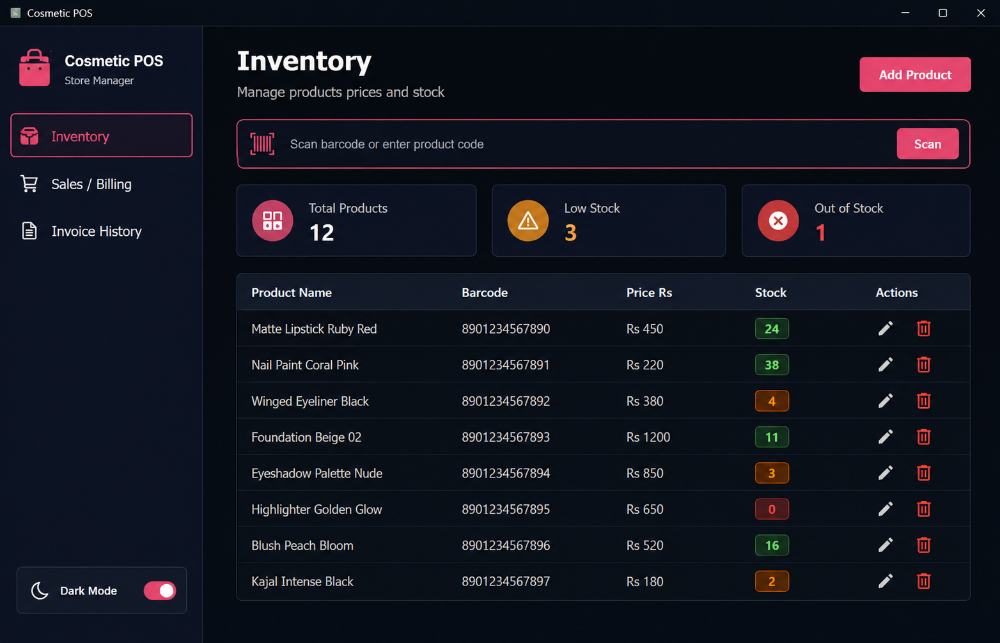
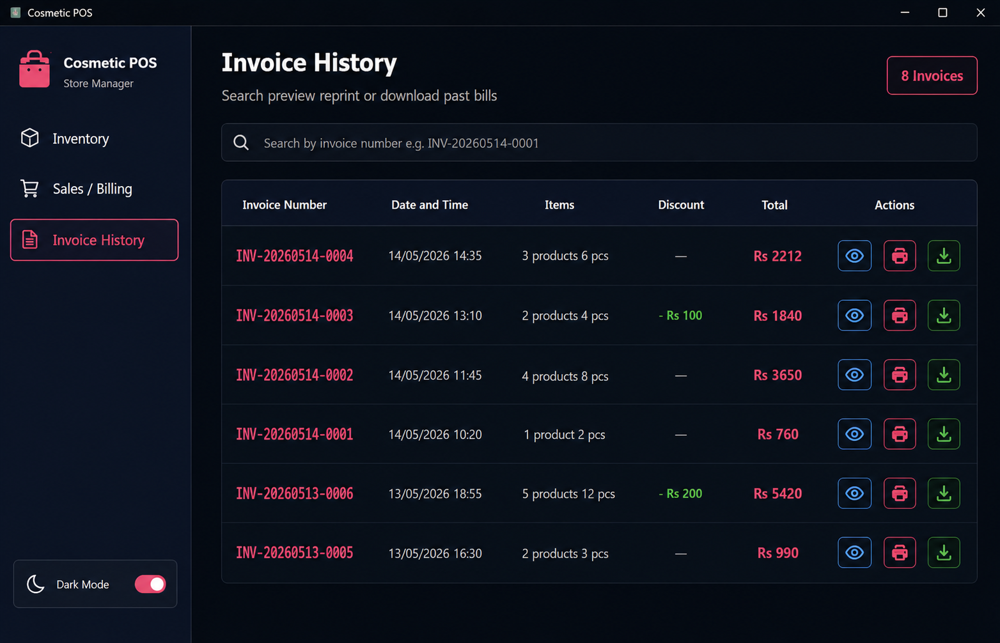
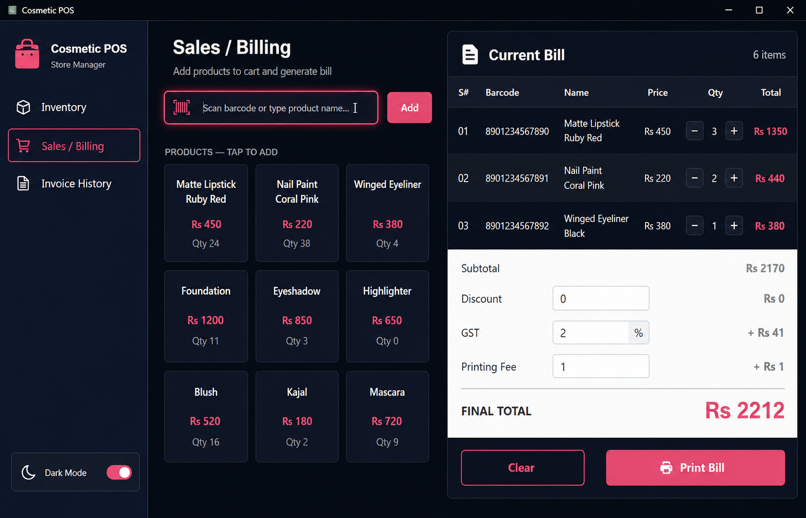
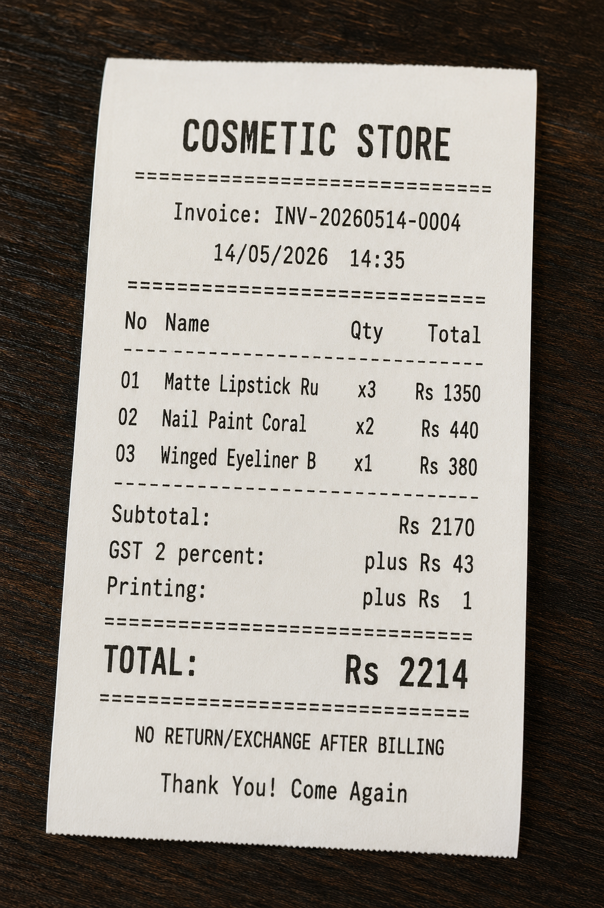

# Cosmetic Store POS

A desktop Point-of-Sale (POS) application built with Flutter for cosmetic/retail stores — inventory management, billing, GST/discount calculation, thermal receipt printing, and invoice history, all running offline on local storage.

<!-- Banner: replace with your own screenshot -->


## Overview

Cosmetic Store POS is a single-workstation billing system aimed at small retail counters. It runs as a native desktop app (Windows/Linux) rather than mobile, and talks directly to thermal receipt printers via raw ESC/POS commands — no cloud backend, no internet dependency. All data (products, invoices) is stored locally with Hive.

## Features

- **Inventory Management** — add, edit, and track products with barcode, price, and stock count
- **Billing / Checkout** — build a cart, apply discounts and GST, calculate totals in real time
- **Thermal Receipt Printing** — raw ESC/POS byte-level receipt generation, sent directly to the OS print spooler (`wmic`/`copy` on Windows, `lp` on Linux) — no printer driver dialog needed
- **Invoice History** — every completed sale is saved and can be reprinted or exported as a `.txt` receipt
- **Dark Mode** — persisted theme preference via `SharedPreferences`
- **Offline-First Storage** — all product and invoice data stored locally using Hive, no backend required

## Screenshots

<!-- Replace these placeholders with your actual screenshots -->
| Inventory | Billing | Invoice History | Bill
|---|---|---|---|
|  |  |  |  

## Tech Stack

- **Framework:** Flutter (desktop target — Windows/Linux)
- **Local Storage:** [Hive](https://pub.dev/packages/hive_flutter) (products, invoices)
- **Preferences:** `shared_preferences` (theme persistence)
- **Printing:** Raw ESC/POS command byte-building, dispatched via native OS process calls (`dart:io Process`)
- **State Management:** `ChangeNotifier` (ThemeProvider)

## Project Structure

```
lib/
├── main.dart                   # App entry point
├── theme/
│   └── theme_provider.dart     # Light/dark theme + color scheme
├── models/
│   └── models.dart             # Product, BillItem, InvoiceItem, Invoice
├── data/
│   └── data_store.dart         # Hive-backed read/write layer
├── utils/
│   └── esc_pos_builder.dart    # Raw ESC/POS receipt byte builder
├── screens/
│   ├── app_root.dart           # MaterialApp root
│   ├── main_shell.dart         # Navigation shell
│   ├── inventory_page.dart     # Product list, add/edit/delete
│   ├── billing_page.dart       # Cart, discount/GST calc, checkout
│   └── invoice_history_page.dart
└── widgets/
    ├── sidebar.dart
    ├── product_dialog.dart
    ├── bill_preview_dialog.dart
    └── table_header.dart
```

Split by responsibility — models, data layer, business logic (ESC/POS builder), and UI (screens/widgets) are kept separate rather than crammed into one file.

## Getting Started

### Prerequisites
- Flutter SDK installed ([flutter.dev](https://flutter.dev))
- Desktop support enabled: `flutter config --enable-windows-desktop` or `--enable-linux-desktop`

### Run locally
```bash
git clone https://github.com/probnk/pos.git
cd pos
flutter pub get
flutter run -d windows   # or -d linux
```

### Dependencies
Make sure your `pubspec.yaml` includes:
```yaml
dependencies:
  flutter:
    sdk: flutter
  hive_flutter: ^1.1.0
  shared_preferences: ^2.2.0
```

## Printing Setup

- **Windows:** the app queries installed printers via `wmic printer get name` and sends raw bytes directly to the selected printer's spool path.
- **Linux:** uses `lp -o raw` to send raw ESC/POS bytes to the default CUPS printer.
- Make sure your thermal printer is installed and set up at the OS level before printing from the app.

## License

MIT

## Author

**Umar Farooq**
Flutter Developer | [GitHub](https://github.com/probnk)
